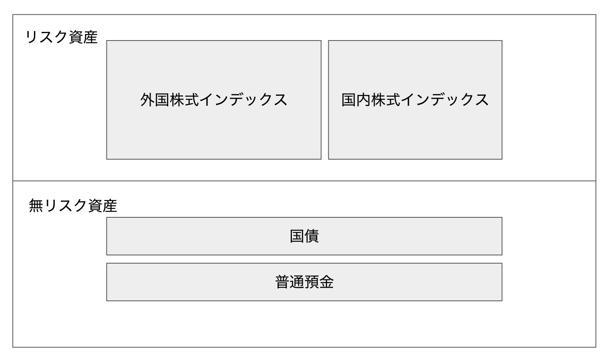

# Гарчиг

1. 資産運用(Asset Management) хийж эхэлцгээе
2. Маш энгийн аргаар хөрөнгөө ихэсгэх энгийн мэдлэг
3. Японд хөрөнгө оруулалт хийцгээе

## Оршил

<!-- why -->
Ойрын үед 資産運用(asset management) буюу хөрөнгө оруулалтын талаар судалж эхэлж байгаа учраас өөрийн мэдсэн зүйлсээ энэ блогоор тэмдэглэл болгон үлдээе гэж бодлоо.

[マンガでわかる シンプルで正しいお金の増やし方](https://www.amazon.co.jp/dp/B086DRJ164/ref=cm_sw_em_r_mt_dp_U_VBOFEbDWPYZ0X) буюу **Энгийнээр хөрөнгөө нэмэгдүүлэх арга** гэсэн номыг уншсан бөгөөд өөрийн ойлгосноо хураангуулан бичье.

 <!-- target readers  -->
Япон ном учраас, японы зах зээлд хөрөнгө оруулалмаар байгаа хүмүүст зориулагдаг бичсэн ном болно.

<!-- who i am -->
Миний хувьд гэвэл японд IT -аар ажилладаг бөгөөд ямар нэгэн эдийн засгийн мэргэжлийн хүн биш учир хариуцлага хүлээхгүй болно.

## Гол санаа

Анхан шатны хүмүүст зориулсан хөрөнгөө нэмэгдүүлэх энгийн бөгөөд риск багатай хөрөнгө оруулалтын аргыг доорх зурагт буулгав.

Хөрөнгө оруулалтаа ерөнхийд нь リスク資産・無リスク資産 буюу эрсдэлээр нт 2 хэсэгт хувааж байгаа.

Эрсдэлгүй хөрөнгө оруулалтанд 普通預金(банкны хадгаламж) болон 国債(улсын бонд), харин эрсдэлтэйд 外国株式インデックス(гадаадын хувьцааны индекс) 国内株式インデックス(дотоодын) хувьцааны индекс) гэж 4 хэсэгт хуваан хөрөнгө оруулахыг зөвлөсөн байсан.

## Тайлбар

#### 普通預金

Хэмжээ: Сарын зардал x 4 сар

#### 国債

#### 外国株式インデックス

#### 国内株式インデックス
- NISA
- IDECO

## Зөвлөмж
- Мэргэжлийн хүмүүст итгэхгүй байх
- Шимтгэл дүрэм: 0.05%
- Интернэтээр гүйлгээгээ хийх
